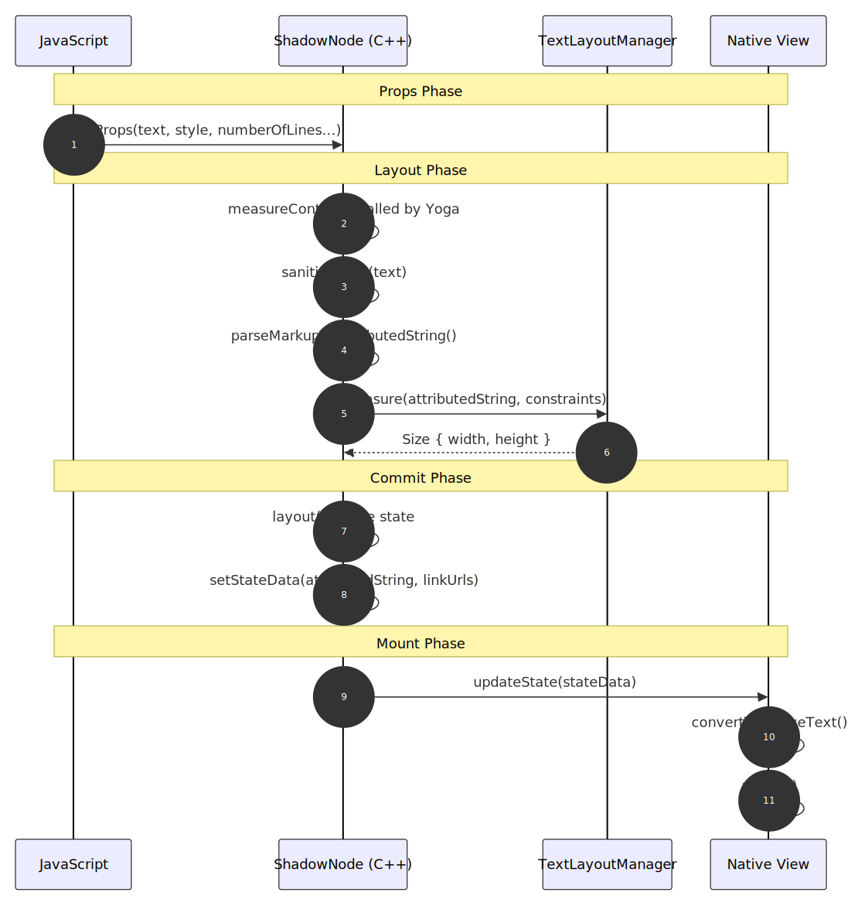

# FabricHTMLText Architecture

This document describes the architecture of the `react-native-fabric-html-text` library, a React Native Fabric component for rendering HTML text with full native performance.

## Architecture Overview

The library is built on React Native's new Fabric architecture and consists of four main layers:

1. **JavaScript Layer** - React component API and TypeScript types
2. **C++ Shared Layer** - Cross-platform HTML parsing and measurement
3. **iOS Native Layer** - Swift/Objective-C rendering with CoreText
4. **Android Native Layer** - Kotlin rendering with TextView/Spannable



### Key Design Principles

- **Single Source of Truth**: HTML is parsed once in C++ and the result is shared with native views via Fabric state
- **Measurement/Rendering Alignment**: The same `AttributedString` used for measurement is used for rendering
- **Security First**: HTML is sanitized at the native layer using industry-standard libraries
- **Cross-Platform Consistency**: Shared C++ parser ensures identical parsing behavior on iOS and Android

## Fabric Shadow Tree and Dynamic Content Measurement

One of the key challenges in rendering HTML in React Native is that the content size is **dynamic and unknown at layout time**. Unlike a fixed-size image or a simple text string, HTML content can contain headings, paragraphs, lists, and inline formatting that all affect the final rendered size. The Fabric architecture solves this through the **Shadow Tree**.

### What is the Shadow Tree?

The Shadow Tree is a lightweight C++ representation of the UI hierarchy that mirrors the React component tree. Each native component has a corresponding **ShadowNode** that:

- Holds the component's props
- Implements layout measurement via Yoga (Facebook's cross-platform layout engine)
- Manages component state that flows to the native view

```
React Tree (JS)          Shadow Tree (C++)           Native Views
┌─────────────┐         ┌─────────────────┐         ┌─────────────┐
│  <HTMLText> │ ──────▶ │ FabricHTMLText  │ ──────▶ │ UIView /    │
│   html="…"  │         │   ShadowNode    │         │ Android View│
└─────────────┘         └─────────────────┘         └─────────────┘
```

### Custom Measurement with measureContent()

The `FabricHTMLTextShadowNode` implements a custom `measureContent()` method that Yoga calls during layout. This is where the magic happens:

```cpp
Size FabricHTMLTextShadowNode::measureContent(
    const LayoutContext& layoutContext,
    const LayoutConstraints& layoutConstraints) const {

  // 1. Parse HTML to AttributedString (styled text fragments)
  _attributedString = parseHtmlToAttributedString(props.html, fontSizeMultiplier);

  // 2. Use TextLayoutManager to measure the styled text
  auto measuredSize = textLayoutManager->measure(
      AttributedStringBox{_attributedString},
      paragraphAttributes,
      textLayoutContext,
      layoutConstraints);  // Respects parent width constraints

  return measuredSize.size;
}
```

This enables:

1. **Precise Height Calculation**: Given a constrained width (e.g., screen width minus margins), the layout engine calculates exactly how tall the HTML content will be when rendered
2. **Accessibility Scaling**: The `fontSizeMultiplier` from `LayoutContext` ensures measurements account for the user's accessibility font size preferences
3. **Constraint Propagation**: Parent layout constraints flow down, so the HTML content knows its available width

### State: Bridging Measurement and Rendering

After measurement, the parsed `AttributedString` is stored in **Fabric State** and passed to the native view:

```cpp
void FabricHTMLTextShadowNode::layout(LayoutContext layoutContext) {
  // Pass parsed content to the native view via state
  setStateData(FabricHTMLTextState{_attributedString, paragraphAttributes, _linkUrls});
}
```

On Android, this state is serialized to a `MapBuffer` (an efficient binary format) and deserialized in Kotlin. On iOS, the state is passed directly to the Objective-C++ view. The native view then converts the `AttributedString` fragments to platform-specific styled text (`NSAttributedString` or `Spannable`) for rendering.

### Why This Matters for Dynamic HTML

Without Fabric's Shadow Tree architecture, rendering dynamic HTML in React Native would require either:

1. **Fixed Heights**: Requiring developers to manually specify heights, which breaks with dynamic content
2. **Two-Pass Rendering**: Render invisibly first to measure, then render again with the correct size (causes flicker)
3. **JavaScript Measurement**: Measure in JS and communicate back to native (slow, async, race conditions)

With Fabric:

- **Single Pass**: Content is measured and rendered in one synchronous flow
- **No Flicker**: The view is created with the correct size from the start
- **Nested Layouts Work**: HTML content correctly participates in Flexbox layouts, ScrollViews, etc.
- **Updates are Efficient**: When HTML changes, only the affected ShadowNode re-measures

### Example: Dynamic Content in a ScrollView

```tsx
<ScrollView>
  <Text>Header</Text>
  <HTMLText html={dynamicHtmlFromApi} style={{ fontSize: 16 }} />
  <Text>Footer</Text>
</ScrollView>
```

The Shadow Tree ensures:
1. `HTMLText`'s ShadowNode measures the dynamic HTML content
2. Yoga calculates the total ScrollView content height
3. The native ScrollView gets the correct `contentSize`
4. Everything renders in the correct position with no layout jumps

## Component Interaction

The following sequence diagram shows how components interact during rendering:



### Lifecycle Phases

1. **Props Phase**: JavaScript passes HTML and styling props to the native component
2. **Layout Phase**: C++ ShadowNode measures content using `TextLayoutManager`
3. **Commit Phase**: Parsed `AttributedString` is passed to view via Fabric state
4. **Render Phase**: Platform view converts fragments to native styled text and renders

## Data Flow



### Data Transformation Pipeline

| Stage | Input | Output | Location |
|-------|-------|--------|----------|
| 1. Component | HTML string | Props object | `src/components/HTMLText.tsx` |
| 2. Adapter | Props | Native props | `src/adapters/native.tsx` |
| 3. Sanitize | Raw HTML | Safe HTML | iOS: `FabricHTMLSanitizer.swift`, Android: `FabricHTMLSanitizer.kt` |
| 4. Parse | Safe HTML | Text segments | `cpp/FabricHTMLParser.cpp` |
| 5. Build | Segments | `AttributedString` | `cpp/FabricHTMLParser.cpp` |
| 6. Measure | `AttributedString` | Size | `TextLayoutManager` |
| 7. State | `AttributedString` + URLs | State data | Platform ShadowNode |
| 8. Convert | State data | Platform text | `FabricHTMLFragmentParser` |
| 9. Render | Platform text | Pixels | CoreText / TextView |

## Security Architecture



### Defense in Depth

The library implements multiple layers of security:

1. **Native Sanitization**: HTML is sanitized in the native layer using:
   - **iOS**: [SwiftSoup](https://github.com/scinfu/SwiftSoup) - Swift port of jsoup
   - **Android**: [OWASP Java HTML Sanitizer](https://github.com/OWASP/java-html-sanitizer)

2. **Allowlist-Based Filtering**:
   - Only allowed tags: `p`, `h1-h6`, `strong`, `b`, `em`, `i`, `u`, `s`, `a`, `ul`, `ol`, `li`, `br`, `span`
   - Only allowed attributes: `href` (on `<a>`), `class`
   - Only allowed protocols: `http`, `https`, `mailto`, `tel`

3. **URL Validation**: Link URLs are validated again at render time to prevent XSS

4. **No Script Execution**: Rendered output is styled text only - no JavaScript execution possible

### Blocked Threats

- XSS via `<script>` tags or event handlers (`onclick`, `onerror`, etc.)
- JavaScript protocol URLs (`javascript:alert(1)`)
- Data URLs with executable content
- Style injection via `<style>` tags or `style` attributes
- VBScript and other dangerous protocols

## File Structure



### Key Files by Layer

#### JavaScript Layer (`src/`)

| File | Purpose |
|------|---------|
| `index.tsx` | Public API exports |
| `FabricHTMLTextNativeComponent.ts` | Codegen native component spec |
| `components/HTMLText.tsx` | Main React component |
| `adapters/native.tsx` | Native platform adapter |
| `core/sanitize.ts` | Sanitization (pass-through to native) |
| `core/constants.ts` | Shared constants |

#### C++ Shared Layer (`cpp/`)

| File | Purpose |
|------|---------|
| `FabricHTMLParser.h` | HTML parser interface |
| `FabricHTMLParser.cpp` | Cross-platform HTML parsing implementation |

#### iOS Native Layer (`ios/`)

| File | Purpose |
|------|---------|
| `FabricHTMLText.mm` | Fabric component view |
| `FabricHTMLTextShadowNode.mm` | Measurement and state management |
| `FabricHTMLFragmentParser.mm` | C++ to NSAttributedString conversion |
| `FabricHTMLSanitizer.swift` | SwiftSoup HTML sanitizer |
| `FabricHTMLCoreTextView.m` | CoreText-based rendering |
| `FabricHTMLTextComponentDescriptor.h` | Fabric component descriptor |

#### Android Native Layer (`android/src/main/java/`)

| File | Purpose |
|------|---------|
| `FabricHTMLTextViewManager.kt` | React Native view manager |
| `FabricHTMLTextView.kt` | Custom TextView implementation |
| `FabricHTMLFragmentParser.kt` | MapBuffer to Spannable conversion |
| `FabricHTMLSanitizer.kt` | OWASP HTML sanitizer |
| `FabricHtmlSpannableBuilder.kt` | Spannable construction |
| `FabricGeneratedConstants.kt` | Generated constants |

## Core Concepts

### AttributedString

The C++ `AttributedString` is React Native's cross-platform representation of styled text. It consists of:

- **Fragments**: Runs of text with consistent styling
- **TextAttributes**: Font size, weight, style, color, decorations, etc.
- **ParagraphAttributes**: Line height, alignment, etc.

The library's HTML parser converts HTML into `AttributedString` fragments, enabling:
- Consistent measurement via `TextLayoutManager`
- State-based rendering without re-parsing
- Cross-platform styling consistency

### Fragment-Based Rendering

Instead of parsing HTML twice (once for measurement, once for rendering), the library:

1. Parses HTML to `AttributedString` in C++ during measurement
2. Stores the `AttributedString` in Fabric state
3. Passes state to native view on commit
4. Native view converts fragments to platform text (NSAttributedString/Spannable)

This eliminates measurement/rendering misalignment issues.

### Link Handling

Links are handled through a multi-step process:

1. **Parsing**: `<a href="...">` tags are parsed, URLs extracted
2. **State**: Link URLs are stored alongside fragments in state
3. **Rendering**: Links are rendered with underline and blue color
4. **Interaction**: Taps trigger `onLinkPress` callback with URL and type
5. **Detection**: Optional auto-detection of URLs, emails, and phone numbers

## Supported HTML Tags

| Tag | Description |
|-----|-------------|
| `<p>` | Paragraph |
| `<h1>` - `<h6>` | Headings |
| `<strong>`, `<b>` | Bold text |
| `<em>`, `<i>` | Italic text |
| `<u>` | Underlined text |
| `<s>` | Strikethrough text |
| `<a href="...">` | Links |
| `<ul>`, `<ol>`, `<li>` | Lists |
| `<br>` | Line break |
| `<span>` | Inline container |

## Styling

### Base Styles

Text styles are passed as React Native `TextStyle` props:

```tsx
<HTMLText
  html="<p>Hello <strong>World</strong></p>"
  style={{
    fontSize: 16,
    lineHeight: 24,
    color: '#333',
    fontFamily: 'System',
  }}
/>
```

### Tag-Specific Styles

Override styles for specific HTML tags:

```tsx
<HTMLText
  html="<p>Click <a href='#'>here</a></p>"
  tagStyles={{
    a: { color: '#007AFF', textDecorationLine: 'none' },
    strong: { color: '#CC0000' },
  }}
/>
```

## Performance Considerations

1. **No Bridge Crossing**: Fabric's synchronous C++ layer eliminates async bridge overhead
2. **Single Parse**: HTML is parsed once and cached in state
3. **Native Rendering**: CoreText (iOS) and TextView (Android) provide optimal rendering
4. **Lazy Sanitization**: Sanitization happens only when HTML changes
5. **MapBuffer**: Efficient binary serialization for state transfer (Android)
