# FabricRichText Architecture

This document describes the architecture of the `react-native-fabric-rich-text` library, a React Native Fabric component for rendering HTML text with full native performance across iOS, Android, and Web platforms.

> For comprehensive technical details on each system, see [SYSTEM-SPECIFICATION.md](./SYSTEM-SPECIFICATION.md).

## Architecture Overview

The library is built on React Native's new Fabric architecture and consists of five main layers:

1. **JavaScript Layer** - React component API and TypeScript types
2. **C++ Shared Layer** - Cross-platform HTML parsing and measurement
3. **iOS Native Layer** - Swift/Objective-C rendering with CoreText
4. **Android Native Layer** - Kotlin rendering with TextView/Spannable
5. **Web Layer** - Next.js/SSR compatible rendering with DOMPurify


### Key Design Principles

- **Single Source of Truth**: HTML is parsed once in C++ and the result is shared with native views via Fabric state
- **Measurement/Rendering Alignment**: The same `AttributedString` used for measurement is used for rendering
- **Security First**: HTML is sanitized at the native layer using industry-standard libraries (SwiftSoup, OWASP, DOMPurify)
- **Cross-Platform Consistency**: Shared C++ parser ensures identical parsing behavior on iOS and Android
- **Web Compatibility**: Same API works on React Native Web and Next.js with SSR support

## Architecture Diagrams

| Diagram | Description |
|---------|-------------|
| [architecture-overview.svg](./architecture-overview.svg) | High-level system architecture showing all platforms |
| [component-interaction.svg](./component-interaction.svg) | Sequence diagram of component lifecycle phases |
| [data-flow.svg](./data-flow.svg) | Data transformation from HTML input to rendered pixels |
| [file-structure.svg](./file-structure.svg) | Codebase organization by layer |
| [native-bridge.svg](./native-bridge.svg) | Fabric/TurboModule architecture and state transfer |
| [security-architecture.svg](./security-architecture.svg) | XSS prevention and defense-in-depth layers |
| [truncation-system.svg](./truncation-system.svg) | numberOfLines implementation across platforms |
| [web-architecture.svg](./web-architecture.svg) | Web/Next.js SSR implementation |
| [nativewind-integration.svg](./nativewind-integration.svg) | Tailwind CSS styling integration flow |

## Fabric Shadow Tree and Dynamic Content Measurement

One of the key challenges in rendering HTML in React Native is that the content size is **dynamic and unknown at layout time**. Unlike a fixed-size image or a simple text string, HTML content can contain headings, paragraphs, lists, and inline formatting that all affect the final rendered size. The Fabric architecture solves this through the **Shadow Tree**.

### What is the Shadow Tree?

The Shadow Tree is a lightweight C++ representation of the UI hierarchy that mirrors the React component tree. Each native component has a corresponding **ShadowNode** that:

- Holds the component's props
- Implements layout measurement via Yoga (Facebook's cross-platform layout engine)
- Manages component state that flows to the native view

```
React Tree (JS)          Shadow Tree (C++)           Native Views
+--------------+         +------------------+         +--------------+
|  <RichText>  | ------> | FabricRichText   | ------> | UIView /     |
|   html="..."  |         |   ShadowNode     |         | Android View |
+--------------+         +------------------+         +--------------+
```

### Custom Measurement with measureContent()

The `FabricRichTextShadowNode` implements a custom `measureContent()` method that Yoga calls during layout:

```cpp
Size FabricRichTextShadowNode::measureContent(
    const LayoutContext& layoutContext,
    const LayoutConstraints& layoutConstraints) const {

  // 1. Parse HTML to AttributedString (styled text fragments)
  _attributedString = parseHtmlToAttributedString(props.html, fontSizeMultiplier);

  // 2. Use TextLayoutManager to measure the styled text
  auto measuredSize = textLayoutManager->measure(
      AttributedStringBox{_attributedString},
      paragraphAttributes,
      textLayoutContext,
      layoutConstraints);  // Respects parent width constraints

  return measuredSize.size;
}
```

This enables:

1. **Precise Height Calculation**: Given a constrained width, the layout engine calculates exactly how tall the HTML content will be
2. **Accessibility Scaling**: The `fontSizeMultiplier` ensures measurements account for the user's accessibility preferences
3. **Constraint Propagation**: Parent layout constraints flow down, so the HTML content knows its available width

### State: Bridging Measurement and Rendering

After measurement, the parsed `AttributedString` is stored in **Fabric State** and passed to the native view:

```cpp
void FabricRichTextShadowNode::layout(LayoutContext layoutContext) {
  // Pass parsed content to the native view via state
  setStateData(FabricRichTextState{_attributedString, paragraphAttributes, _linkUrls});
}
```

On Android, this state is serialized to a `MapBuffer` (an efficient binary format) and deserialized in Kotlin. On iOS, the state is passed directly to the Objective-C++ view.

## Component Interaction


### Lifecycle Phases

1. **Props Phase**: JavaScript passes HTML and styling props to the native component
2. **Layout Phase**: C++ ShadowNode measures content using `TextLayoutManager`
3. **Commit Phase**: Parsed `AttributedString` is passed to view via Fabric state
4. **Render Phase**: Platform view converts fragments to native styled text and renders

## Data Flow


### Data Transformation Pipeline

| Stage | Input | Output | Location |
|-------|-------|--------|----------|
| 0. NativeWind (Optional) | `className` string | Style object | `src/nativewind.ts` via `cssInterop` |
| 1. Component | HTML string + style | Props object | `src/components/RichText.tsx` |
| 2. Adapter | Props | Native props | `src/adapters/native.tsx` |
| 3. Sanitize | Raw HTML | Safe HTML | Platform-specific sanitizers |
| 4. Parse | Safe markup | Text segments | `cpp/FabricMarkupParser.cpp` |
| 5. Build | Segments | `AttributedString` | `cpp/FabricMarkupParser.cpp` |
| 6. Measure | `AttributedString` | Size | `TextLayoutManager` |
| 7. State | `AttributedString` + URLs | State data | Platform ShadowNode |
| 8. Convert | State data | Platform text | `FabricRichFragmentParser` |
| 9. Render | Platform text | Pixels | CoreText / TextView / DOM |

## Native Bridge Architecture



The native bridge diagram shows the detailed flow of data through:
- Fabric's UIManager and Scheduler
- C++ Shadow Tree with custom measurement
- State transfer mechanisms (direct on iOS, MapBuffer on Android)
- Platform-specific view rendering

## Security Architecture


### Defense in Depth

The library implements multiple layers of security with platform-specific strategies:

1. **Platform-Specific Sanitization**:
   - **Web**: [DOMPurify](https://github.com/cure53/DOMPurify) sanitization in the JavaScript layer
   - **iOS**: [SwiftSoup](https://github.com/scinfu/SwiftSoup) sanitization in native code
   - **Android**: [OWASP Java HTML Sanitizer](https://github.com/OWASP/java-html-sanitizer) in native code

2. **Allowlist-Based Filtering** (consistent across all platforms):
   - Only allowed tags: `p`, `div`, `h1-h6`, `strong`, `b`, `em`, `i`, `u`, `s`, `del`, `a`, `ul`, `ol`, `li`, `br`, `span`, `blockquote`, `pre`
   - Only allowed attributes: `href` (on `<a>`), `class`
   - Only allowed protocols: `http`, `https`, `mailto`, `tel`

3. **URL Validation**: Link URLs are validated at multiple points:
   - During HTML parsing (C++ layer blocks `javascript:`, `data:`, `vbscript:`)
   - At render time in native views (iOS/Android)

4. **No Script Execution**: Rendered output is styled text only - no JavaScript execution possible

### Blocked Threats

- XSS via `<script>` tags or event handlers (`onclick`, `onerror`, etc.)
- JavaScript protocol URLs (`javascript:alert(1)`)
- Data URLs with executable content
- Style injection via `<style>` tags or `style` attributes
- VBScript and other dangerous protocols

## Text Truncation System



The truncation system implements `numberOfLines` across all platforms:

- **C++ Measurement**: Uses `ParagraphAttributes.maximumNumberOfLines` for constrained height
- **iOS**: `CTLineCreateTruncatedLine` with ellipsis character
- **Android**: `StaticLayout.Builder.setMaxLines()` with `TruncateAt.END`
- **Web**: CSS `-webkit-line-clamp`

Includes optional height animation via `animationDuration` prop.

## Web Architecture



The web implementation provides:

- **SSR Compatibility**: Dual-sanitizer approach - DOMPurify (browser) and sanitize-html (Node.js/SSR)
- **Style Conversion**: React Native TextStyle to CSS Properties
- **Native Truncation**: Uses CSS line-clamp for numberOfLines
- **Same API**: Identical props as native component

## NativeWind Integration



Optional [NativeWind](https://www.nativewind.dev/) support enables Tailwind CSS styling:

```tsx
import { RichText } from 'react-native-fabric-rich-text/nativewind';

<RichText
  html="<p>Hello World</p>"
  className="text-blue-500 text-lg p-4"
/>
```

See [docs/nativewind-setup.md](../nativewind-setup.md) for configuration.

## File Structure


### Key Files by Layer

#### JavaScript Layer (`src/`)

| File | Purpose |
|------|---------|
| `index.tsx` | Public API exports |
| `index.web.tsx` | Web platform exports |
| `nativewind.ts` | NativeWind-compatible exports with `cssInterop` pre-applied |
| `FabricRichTextNativeComponent.ts` | Codegen native component spec |
| `components/RichText.tsx` | Main React component |
| `components/RichText.web.tsx` | Web platform React component |
| `adapters/native.tsx` | Native platform adapter |
| `adapters/web/StyleConverter.ts` | React Native style to CSS conversion |
| `core/sanitize.ts` | Sanitization (pass-through to native) |
| `core/sanitize.web.ts` | Web sanitization with DOMPurify |
| `core/constants.ts` | Single source of truth for allowed HTML |
| `types/RichTextNativeProps.ts` | TypeScript type definitions |

#### C++ Shared Layer (`cpp/`)

| File | Purpose |
|------|---------|
| `FabricMarkupParser.h` | Markup parser interface |
| `FabricMarkupParser.cpp` | Cross-platform markup parsing implementation |

#### iOS Native Layer (`ios/`)

| File | Purpose |
|------|---------|
| `FabricRichText.mm` | Fabric component view |
| `FabricRichTextShadowNode.mm` | Measurement and state management |
| `FabricRichTextComponentDescriptor.h` | Fabric component descriptor |
| `FabricRichFragmentParser.mm` | C++ AttributedString to NSAttributedString conversion |
| `FabricRichSanitizer.swift` | SwiftSoup HTML sanitizer |
| `FabricRichCoreTextView.m` | CoreText-based rendering with truncation |
| `FabricGeneratedConstants.swift` | Generated constants for styling |

#### Android Layers

**JNI Layer (`android/src/main/jni/`)**

| File | Purpose |
|------|---------|
| `ShadowNodes.cpp` | C++ shadow node implementation for measurement |
| `FabricRichTextState.cpp` | State serialization to MapBuffer |

**Kotlin Layer (`android/src/main/java/` and `react/`)**

| File | Purpose | Path |
|------|---------|------|
| `FabricRichTextViewManager.kt` | React Native view manager | `react/` |
| `FabricRichTextView.kt` | Custom TextView with state-based rendering | `java/` |
| `FabricRichFragmentParser.kt` | MapBuffer to Spannable conversion | `react/` |
| `FabricRichSanitizer.kt` | OWASP HTML sanitizer | `java/` |
| `FabricHtmlSpannableBuilder.kt` | Spannable construction | `java/` |
| `FabricCustomLineHeightSpan.kt` | Custom line height span implementation | `java/` |
| `FabricGeneratedConstants.kt` | Generated constants for styling | `java/` |

## Core Concepts

### AttributedString

The C++ `AttributedString` is React Native's cross-platform representation of styled text. It consists of:

- **Fragments**: Runs of text with consistent styling
- **TextAttributes**: Font size, weight, style, color, decorations, etc.
- **ParagraphAttributes**: Maximum lines, ellipsize mode, etc.

### Fragment-Based Rendering

Instead of parsing HTML twice (once for measurement, once for rendering), the library:

1. Parses HTML to `AttributedString` in C++ during measurement
2. Stores the `AttributedString` in Fabric state
3. Passes state to native view on commit
4. Native view converts fragments to platform text (NSAttributedString/Spannable)

This eliminates measurement/rendering misalignment issues.

### Link Handling

Links are handled through a multi-step process:

1. **Parsing**: `<a href="...">` tags are parsed, URLs extracted
2. **State**: Link URLs are stored alongside fragments in state
3. **Rendering**: Links are rendered with underline and blue color
4. **Interaction**: Taps trigger `onLinkPress` callback with URL and type
5. **Detection**: Optional auto-detection of URLs, emails, and phone numbers

## Supported HTML Tags

| Tag | Description |
|-----|-------------|
| `<p>` | Paragraph |
| `<div>` | Block container |
| `<h1>` - `<h6>` | Headings |
| `<strong>`, `<b>` | Bold text |
| `<em>`, `<i>` | Italic text |
| `<u>` | Underlined text |
| `<s>`, `<del>` | Strikethrough text |
| `<a href="...">` | Links |
| `<ul>`, `<ol>`, `<li>` | Lists |
| `<br>` | Line break |
| `<span>` | Inline container |
| `<blockquote>` | Block quote |
| `<pre>` | Preformatted text |

## Styling

### Base Styles

Text styles are passed as React Native `TextStyle` props:

```tsx
<RichText
  html="<p>Hello <strong>World</strong></p>"
  style={{
    fontSize: 16,
    lineHeight: 24,
    color: '#333',
    fontFamily: 'System',
  }}
/>
```

### Tag-Specific Styles

Override styles for specific HTML tags:

```tsx
<RichText
  html="<p>Click <a href='#'>here</a></p>"
  tagStyles={{
    a: { color: '#007AFF', textDecorationLine: 'none' },
    strong: { color: '#CC0000' },
  }}
/>
```

## Performance Considerations

1. **No Bridge Crossing**: Fabric's synchronous C++ layer eliminates async bridge overhead
2. **Single Parse**: HTML is parsed once and cached in state
3. **Native Rendering**: CoreText (iOS) and TextView (Android) provide optimal rendering
4. **Lazy Sanitization**: Sanitization happens only when HTML changes
5. **MapBuffer**: Efficient binary serialization for state transfer (Android)
6. **NativeWind Zero-Runtime**: Tailwind styles are compiled at build time, not runtime

## Further Reading

- [SYSTEM-SPECIFICATION.md](./SYSTEM-SPECIFICATION.md) - Comprehensive technical reference for all systems
- [../nativewind-setup.md](../nativewind-setup.md) - NativeWind configuration guide
- [../web-integration.md](../web-integration.md) - Web/Next.js integration guide
